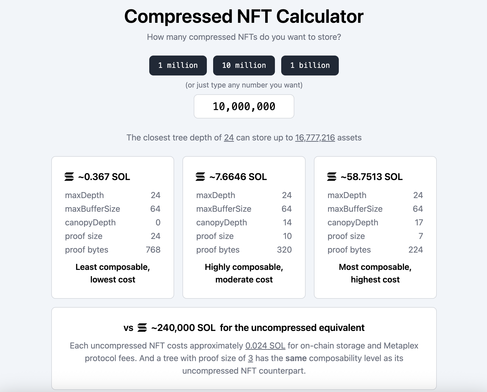
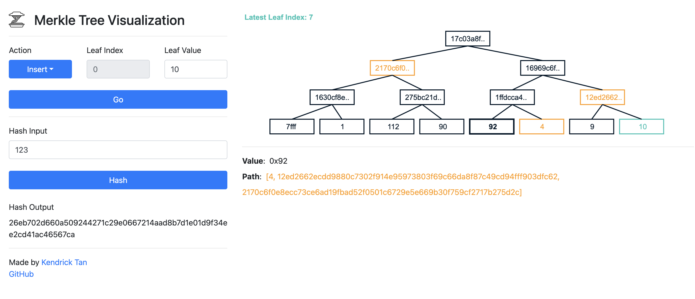

# Driftly cNFT Implementation for Hackathon Teams

### Integrate Compressed NFTs (cNFTs) into Your DApp

### Overview
Compressed NFTs (cNFTs) on Solana deliver massive scale at a fraction of the cost by storing asset data off-chain and anchoring integrity on-chain via Merkle trees. You mint millions of NFTs with on-chain verifiability, while paying only for compact hash updates.

- **NFT Collection (On-chain)**: A standard collection NFT (Metaplex Token Metadata) acts as the parent reference for your cNFTs, created with `createNft()`.
- **Merkle Tree (On-chain)**: A concurrent Merkle tree tracks compressed leaves (NFTs). Only the minimal hash footprint is on-chain, enabling extreme cost savings. We create it with `createTree()` from `@metaplex-foundation/mpl-bubblegum`.
- **Minting (Compressed, Off-chain + On-chain proof)**: `mintToCollectionV1()` writes NFT metadata off-chain and commits a proof to the Merkle tree on-chain. Ownership, verification, and provenance are still cryptographically anchored on-chain.

Why this approach
- **Scale**: Games, loyalty programs, tickets, and promotions regularly need 10^5–10^7 assets. cNFTs make this economically viable.
- **Cost**: You pay for Merkle updates, not full metadata writes. Expect orders of magnitude cheaper than traditional NFTs.
- **Speed**: Mints finalize quickly with small on-chain footprints.
- **Composability**: Still uses the familiar Metaplex stack and Solana ownership semantics.

---

### Architecture
- **Contracts/Programs**
  - Metaplex Token Metadata: defines collection + NFT metadata standard.
  - Metaplex Bubblegum: enables creation of Merkle trees and compressed mint operations.
- **Data Flow**
  1. Create a collection NFT on-chain (standard NFT).
  2. Create a Merkle tree on-chain (Bubblegum).
  3. Upload assets/JSON to IPFS (recommended) or a gateway; store URLs in metadata.
  4. Mint cNFTs to wallet(s) with `mintToCollectionV1()` which updates the Merkle tree.
  5. Verify ownership and attributes via Helius DAS or by reconstructing Merkle proofs.
- **Files in this repo (dev-internal)**
  - `createNFTCollection.ts`: Creates collection NFT.
  - `createMerkleTree.ts`: Creates Merkle tree account.
  - `mint-all-discounts.ts`: Mints multiple discount types to `addresses.csv`.
  - `mint-hotel-discounts.ts`, `mint-flight-discounts.ts`, `mint-dining-discounts.ts`: Per-category mints.
  - `verifyDiscount.ts`: Quick local metadata verification showcase.
  - `verify-promotions.ts`: Full DAS-powered verification + report.
  - `config.ts`: Core parameters (tree sizes, URLs, collection info).
  - CSVs: `addresses.csv`, `hotel-addresses.csv`, `flight-addresses.csv`, `dining-addresses.csv`.
  - `data/`: Generated outputs (mints, Merkle/collection IDs, verification reports).

---

### Settings
Before running scripts, configure the project.

- **.env**
  - Use Helius (recommended) or default RPCs.
  ```env
  NODE_ENV=development
  SOLANA_MAINNET_RPC_URL=https://rpc.helius.xyz/?api-key=<HELIUS_API_KEY>
  SOLANA_DEVNET_RPC_URL=https://devnet.helius-rpc.com/?api-key=<HELIUS_API_KEY>
  ```

- **key.json**
  - Place a standard Solana JSON secret key (payer wallet) in this folder as `key.json`.
  - **Format:** This should be a JSON array, typically 64 numbers, generated by Solana tools.
  - **How to generate:**  
    Use [`solana-keygen grind`](https://docs.solana.com/wallet-guide/paper-wallet#grinding-for-vanity-addresses) or any standard Solana keygen command.
    ```bash
    solana-keygen grind --starts-with ABC:1 --outfile key.json
    ```
    Or simply:
    ```bash
    solana-keygen new --outfile key.json
    ```
    The resulting `key.json` will contain something like:
    ```json
    [123, 87, 45, 32, ... 188]
    ```
    **Keep this file secret! This is your wallet's private key.**

- **config.ts**
  - Merkle tree sizing (only specific pairs are valid in SPL ConcurrentMerkleTree):
    - 14 → (64, 256, 1024, 2048)
    - 20 → (64, 256, 1024, 2048)
    - 24 → (64, 256, 512, 1024, 2048)
    - 26 → (64, 256, 512, 1024, 2048)
    - 30 → (512, 1024, 2048)
  - Recommended defaults here: `MERKLE_MAX_DEPTH=14`, `MERKLE_MAX_BUFFER_SIZE=64` (suitable for hackathon demos).
  - URLs:
    - `METADATA_COLLECTION_URL`: Collection JSON.
    - `METADATA_ITEM_URL`: Default item JSON (can be per-mint).
    - `IMAGE_URL`: Default image URL.
  - Collection Info: `COLLECTION_NAME`, `COLLECTION_SYMBOL`, `COLLECTION_DESCRIPTION`.
  - Royalties: `FEE_PERCENT` in basis points (e.g., `550` = 5.5%).
  - External link: `EXTERNAL_URL` currently set to `https://x.com/Ayushjhax`.

- **IPFS-first Workflow (Recommended)**
  - Use your IPFS uploader (frontend has an uploader) to host images and JSON.
  - Use `ipfs://` URIs (with HTTP gateway fallback) in `config.ts` and JSON.

- **Airdrop CSVs**
  - Single column: `address`
  ```csv
  address
  <ValidSolanaAddress1>
  <ValidSolanaAddress2>
  ```

---

### Metadata Examples (ready for IPFS)
- **Collection (discount-collection-metadata.json)**
```json
{
  "name": "DealCoin Discount Collection",
  "symbol": "DEAL",
  "description": "Verifiable discount coupons powered by cNFTs. Each promotion is a transferable NFT that grants real-world savings.",
  "image": "ipfs://<CID>/discount-collection.png",
  "external_url": "https://x.com/Ayushjhax",
  "properties": {
    "category": "image",
    "files": [{ "uri": "ipfs://<CID>/discount-collection.png", "type": "image/png" }]
  }
}
```

- **Item – Hotel (discount-MBS-20OFF-2024.json)**
```json
{
  "name": "20% Off Hotel Stay in Singapore",
  "symbol": "DEAL",
  "description": "Experience luxury at Marina Bay Sands. Valid for 3 nights in a Deluxe Room.",
  "image": "ipfs://<CID>/hotel-discount.png",
  "external_url": "https://dealcoin.app/deals/MBS-20OFF-2024",
  "attributes": [
    { "trait_type": "Discount Percentage", "value": 20 },
    { "trait_type": "Original Price", "value": "$800" },
    { "trait_type": "Discounted Price", "value": "$640" },
    { "trait_type": "Savings", "value": "$160" },
    { "trait_type": "Merchant", "value": "Marina Bay Sands" },
    { "trait_type": "Merchant ID", "value": "mbs-singapore" },
    { "trait_type": "Category", "value": "Hotel" },
    { "trait_type": "Location", "value": "Singapore" },
    { "trait_type": "Expiry Date", "value": "2024-12-31" },
    { "trait_type": "Redemption Code", "value": "MBS-20OFF-2024" },
    { "trait_type": "Max Uses", "value": 1 },
    { "trait_type": "Current Uses", "value": 0 },
    { "trait_type": "Status", "value": "Active" },
    { "trait_type": "Transferable", "value": "Yes" },
    { "trait_type": "Platform", "value": "DealCoin" },
    { "trait_type": "Verification Method", "value": "Solana Pay" },
    { "trait_type": "NFT Type", "value": "Compressed NFT" }
  ]
}
```

- **Item – Flight (discount-SKY-TOKYO15-2024.json)**
```json
{
  "name": "15% Off Flight to Tokyo",
  "symbol": "DEAL",
  "description": "Discover Japan with our exclusive discount. Valid for round-trip economy flights.",
  "image": "ipfs://<CID>/flight-discount.png",
  "external_url": "https://dealcoin.app/deals/SKY-TOKYO15-2024",
  "attributes": [
    { "trait_type": "Discount Percentage", "value": 15 },
    { "trait_type": "Original Price", "value": "$1200" },
    { "trait_type": "Discounted Price", "value": "$1020" },
    { "trait_type": "Savings", "value": "$180" },
    { "trait_type": "Merchant", "value": "SkyTravel Airlines" },
    { "trait_type": "Merchant ID", "value": "sky-travel" },
    { "trait_type": "Category", "value": "Flight" },
    { "trait_type": "Location", "value": "Tokyo, Japan" },
    { "trait_type": "Expiry Date", "value": "2024-11-30" },
    { "trait_type": "Redemption Code", "value": "SKY-TOKYO15-2024" },
    { "trait_type": "Max Uses", "value": 1 },
    { "trait_type": "Current Uses", "value": 0 },
    { "trait_type": "Status", "value": "Active" },
    { "trait_type": "Transferable", "value": "Yes" },
    { "trait_type": "Platform", "value": "DealCoin" },
    { "trait_type": "Verification Method", "value": "Solana Pay" },
    { "trait_type": "NFT Type", "value": "Compressed NFT" }
  ]
}
```

- **Item – Dining (discount-LCB-DINING30-2024.json)**
```json
{
  "name": "30% Off Fine Dining Experience",
  "symbol": "DEAL",
  "description": "Indulge in an exquisite 7-course tasting menu at Le Cordon Bleu, Paris.",
  "image": "ipfs://<CID>/restaurant-discount.png",
  "external_url": "https://dealcoin.app/deals/LCB-DINING30-2024",
  "attributes": [
    { "trait_type": "Discount Percentage", "value": 30 },
    { "trait_type": "Original Price", "value": "$200" },
    { "trait_type": "Discounted Price", "value": "$140" },
    { "trait_type": "Savings", "value": "$60" },
    { "trait_type": "Merchant", "value": "Le Cordon Bleu" },
    { "trait_type": "Merchant ID", "value": "le-cordon-bleu" },
    { "trait_type": "Category", "value": "Restaurant" },
    { "trait_type": "Location", "value": "Paris, France" },
    { "trait_type": "Expiry Date", "value": "2024-10-31" },
    { "trait_type": "Redemption Code", "value": "LCB-DINING30-2024" },
    { "trait_type": "Max Uses", "value": 1 },
    { "trait_type": "Current Uses", "value": 0 },
    { "trait_type": "Status", "value": "Active" },
    { "trait_type": "Transferable", "value": "Yes" },
    { "trait_type": "Platform", "value": "DealCoin" },
    { "trait_type": "Verification Method", "value": "Solana Pay" },
    { "trait_type": "NFT Type", "value": "Compressed NFT" }
  ]
}
```

---
### Step-by-step Usage

Follow these steps in order. All commands use Bun.

0. **Clone the repository and enter the template directory**
   ```bashlate
   git clone https://github.com/Ayushjhax/MONKE
   cd MONKE/template
   ```

1. **Create the collection**
   ```bash
   bun run createNFTCollection.ts
   ```

2. **Create the Merkle tree**
   ```bash
   bun run createMerkleTree.ts
   ```

3. **Mint all discount types to main addresses (`addresses.csv`)**
   ```bash
   bun run mint-all-discounts.ts
   ```

4. **(Optional) Mint per-category lists**  
   Avoid duplicates if you already did step 3.
   ```bash
   bun run mint-hotel-discounts.ts
   bun run mint-flight-discounts.ts
   bun run mint-dining-discounts.ts
   ```

5. **Quick verification (local/console)**
   ```bash
   bun run verifyDiscount.ts
   ```

6. **Full verification (Helius DAS + report)**
   ```bash
   bun run verify-promotions.ts
   ```

Outputs go to `data/` (IDs, tx signatures, and verification reports).

---

### Cost, Limits, and Performance

- **Why cNFTs are cheaper**: Only Merkle roots and minimal hashes hit-chain; large JSON blobs live off-chain.

  

- **Tree sizing**: Pick `maxDepth` based on peak NFT count; `2^depth` is the theoretical upper bound of leaves.

  

- **Buffer size**: Choose larger buffers for higher concurrency and update throughput.For high-volume demos, a buffer size of 256+ is recommended. See [Metaplex Bubblegum Docs](https://developers.metaplex.com/bubblegum) for detailed sizing formulas.
- **Throughput tips**: Batch operations, stagger requests, and prefer Helius endpoints for consistent performance.

---

### Security and Integrity
- **Immutability**: Collection settings and key attributes can be locked by design decisions; cNFT proofs bind off-chain JSON to on-chain state.
- **Verification**: Use `verify-promotions.ts` (DAS) and/or on-chain proof validation to check:
  - Ownership, collection membership, category/type, expiry, redemption codes.
- **Fraud checks**: Look for missing platform signature, wrong verification method, or mismatched NFT type (the script flags these).

---

### Troubleshooting
- RPC errors: confirm `.env` endpoints; if rate-limited, increase delays or upgrade Helius plan.
- Missing `key.json`: ensure it’s in this folder and valid.
- Expired promotions: update your item metadata `Expiry Date` to a future value before minting.
- Duplicate mints: avoid running both step 3 and step 4 for the same addresses unless intentional.

---

---

### Resources

- [ZK Compression Official Site](https://www.zkcompression.com/) — Reference docs and quickstart for ZK account compression on Solana.
- [Helius Blog: All You Need to Know About Compression on Solana](https://www.helius.dev/blog/all-you-need-to-know-about-compression-on-solana) — In-depth primer on state compression fundamentals.
- [Helius Blog: Solana NFT Compression](https://www.helius.dev/blog/solana-nft-compression) — Step-by-step tutorial with code examples.
- [Metaplex Bubblegum Docs](https://developers.metaplex.com/bubblegum) — Official docs for cNFT & compression minting/Merkle trees.
- [Compressed.app — cNFT Explorer & Tools](https://compressed.app/) — Visualize, search, and debug compressed NFTs, collections, and Merkle trees.
- [Metaplex Bubblegum GitHub](https://github.com/metaplex-foundation/mpl-bubblegum) — Core JS/Rust implementation.
- [mpl-bubblegum-js API Docs](https://mpl-bubblegum-js-docs.vercel.app/) — JS API documentation for interacting with Bubblegum cNFTs.
- [YouTube: Compressed NFTs on Solana 2024 | Helius](https://www.youtube.com/watch?v=6BpArf2-R68) — Overview video of cNFTs on Solana.
- [YouTube: Minting 1M NFTs for $100 | Helius](https://www.youtube.com/watch?v=ayZUsq6eLzQ) — Real-world test/demo of cNFT mint efficiency.
- [Compression Read API JS Example](https://github.com/metaplex-foundation/compression-read-api-js-examples/blob/master/index.ts#L464) — Advanced example for reading cNFT trees & assets.
- [DEV.to: Minting a Tree for Compressed NFTs (ApolloToday)](https://dev.to/apollotoday/minting-a-tree-for-compressed-nfts-13n7) — Community tutorial on Merkle trees.
- [YouTube: Efficient Merkle Trees & cNFTs](https://www.youtube.com/watch?v=83nIhnxtlW8) — Visualization/why Merkle matters for cNFTs.
- [YouTube: Compressed NFTs with Metaplex Bubblegum](https://www.youtube.com/watch?v=nM3trQX2_5o) — Practical Bubblegum cNFTs walkthrough.
- [Solana Account Compression Docs](https://github.com/solana-labs/solana-program-library/blob/master/docs/src/account-compression.md) — On-chain compression spec and reference.
- [Efficient Merkle Trees Visualizer](https://efficient-merkle-trees.netlify.app/) — Play with Merkle tree parameters visually.
- [How to Mint Compressed NFTs (Medium)](https://medium.com/@laloutre/how-to-mint-compressed-nfts-dfcbee0ef51e) — Hands-on minting guide.

---

### FAQ
- Can I use regular NFTs instead? Yes, but cost/scalability will be significantly higher.
- Can I edit metadata later? Treat cNFT metadata as immutable for trust; create new mints for changes or encode state in attributes/status.
- How big should my tree be? Start with depth 14 for demos; for production, plan capacity using `2^depth` and expected churn.
- Do I need IPFS? Strongly recommended for durability and decentralization.

---

### Support
- External URL is set to `https://x.com/Ayushjhax`. For issues or questions, share console logs and the `data/verification-report-*.json` artifact.